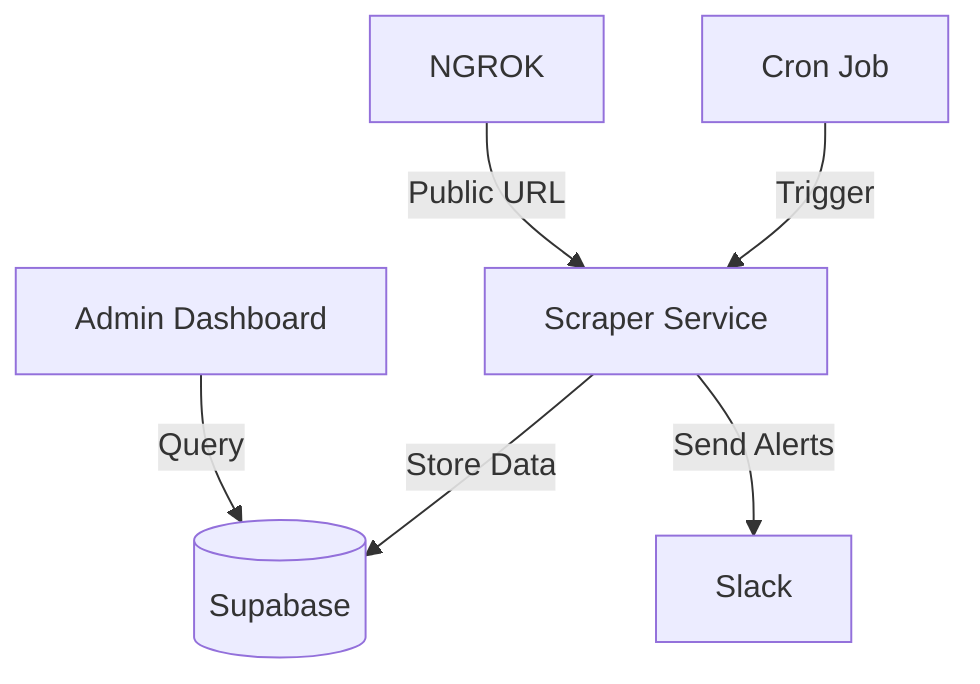

# Restaurant Monitoring System

A real-time restaurant monitoring system that tracks restaurant opening hours and alerts operations teams about discrepancies between expected and actual operating status.

## 🏗️ Architecture Overview



## 🛠️ Tech Stack

- **Frontend**:
  - React 18 with TypeScript
  - Vite for fast development and building
  - Ant Design for UI components
  - React Query for data fetching and caching
  - Chart.js for data visualization

- **Backend**:
  - Node.js with Fastify
  - Supabase (PostgreSQL) for database
  - Puppeteer with Stealth Plugin for web scraping
  - Slack Webhooks for real-time alerts
  - dprint for code formatting
  - ngrok for local development webhook testing

## 🚀 Features

- Real-time restaurant status monitoring
- Automated discrepancy detection
- Instant Slack notifications for mismatches
- Scalable architecture for high-volume monitoring
- Detailed historical data tracking
- Responsive admin dashboard
- Real-time data visualization
- Status filtering and search functionality

## 📦 Prerequisites

- Node.js 18+
- npm or yarn
- Supabase account
- Slack workspace with admin access
- Modern web browser (Chrome, Firefox, Safari, or Edge)

## 🛠️ Setup

1. **Clone the repository**
   ```bash
   git clone <repository-url>
   cd restaurant-monitor
   ```

2. **Install dependencies**
   ```bash
   npm install
   ```

3. **Environment Setup**
   Create a `.env` file:
   ```env
   SUPABASE_URL=your_supabase_url
   SUPABASE_KEY=your_supabase_anon_key
   SLACK_WEBHOOK_URL=your_slack_webhook_url
   ```

4. **Database Setup**
   Run the Supabase migration to create the required tables.

## 🏗️ System Architecture

### Data Flow

1. **Scraping Service**
   - Scheduled to run at configurable intervals
   - Uses Puppeteer with stealth plugin to avoid detection
   - Implements retry logic for failed requests

2. **Data Storage**
   - Self-hosted PostgreSQL database with Supabase
   - `restaurant_status` table with comprehensive tracking
   - Automatic timestamp management

3. **Alerting System**
   - Real-time Slack notifications for mismatches
   - Detailed error messages with timestamps
   - Rate limiting to prevent notification spam

4. **Scheduled Execution**
   - Backend API exposed via ngrok at `https://unexorbitantly-nonmelodramatic-sang.ngrok-free.dev/scrape`
   - Supabase cron job triggers the scrape endpoint every 5 minutes
   - Ensures regular data collection as per requirements
   - Handles retries and error cases gracefully

5. **Monitoring & Observability**
   - Structured logging
   - Error tracking
   - Performance metrics

## 🏠 Self-hosting Supabase

### Prerequisites

- Docker and Docker Compose
- Minimum 2GB RAM server
- Domain name (recommended)

### Cron Job Setup

1. **Configure Supabase Edge Function**
   - Create a new edge function in Supabase
   - Set up to call the ngrok endpoint: `https://unexorbitantly-nonmelodramatic-sang.ngrok-free.dev/scrape`
   - Configure with appropriate authentication headers

2. **Set Up Scheduled Trigger**
   - In Supabase Dashboard, navigate to Database > Triggers
   - Create a new cron job that runs every 5 minutes
   - Point it to the edge function created above
   - Enable the cron job and monitor logs for execution

### Setup Instructions

1. **Clone Supabase**
   ```bash
   git clone --depth 1 https://github.com/supabase/supabase
   cd supabase/docker
   cp .env.example .env
   ```

2. **Configure Environment**
   Update `.env` with:
   ```env
   POSTGRES_PASSWORD=your_secure_password
   JWT_SECRET=your_jwt_secret
   ANON_KEY=your_anon_key
   SERVICE_ROLE_KEY=your_service_role_key
   SITE_URL=http://localhost:3000
   ```

3. **Start Services**
   ```bash
   docker compose -f docker-compose.yml up -d
   ```

4. **Access Dashboard**
   - Studio: http://localhost:3000
   - Kong: http://localhost:8000
   - PostgreSQL: localhost:5432

## 🖥️ Frontend Development

### Getting Started

1. **Navigate to the frontend directory**
   ```bash
   cd frontend
   ```

2. **Install dependencies**
   ```bash
   npm install
   ```

3. **Set up environment variables**
   Copy `.env.example` to `.env` and update with your Supabase credentials:
   ```env
   VITE_SUPABASE_URL=your_supabase_url
   VITE_SUPABASE_ANON_KEY=your_supabase_anon_key
   ```

4. **Start the development server**
   ```bash
   npm run dev
   ```
   The application will be available at `http://localhost:5173`

### Key Features

- **Real-time Dashboard**: Monitor restaurant statuses in real-time
- **Status Overview**: Quick view of open/closed restaurants and mismatches
- **Detailed View**: Click on any restaurant for detailed status history
- **Responsive Design**: Works on desktop and mobile devices
- **Search & Filter**: Easily find specific restaurants or filter by status

### Available Scripts

- `npm run dev`: Start development server
- `npm run format`: Format code with dprint

## 🚀 Production Deployment

### Scaling to 10,000+ Restaurants

1. **Distributed Scraping**
   - Implement worker queues (e.g., BullMQ)
   - Distribute scraping across multiple instances
   - Implement rate limiting and backoff strategies

2. **Database Optimization**
   - Read replicas for reporting
   - Connection pooling
   - Query optimization with proper indexing

3. **Cost Estimation (Self-hosted)**
   - Server: $5-10/month (VPS like DigitalOcean/Linode)
   - Storage: $1-5/month (scales with data)
   - Total: ~$6-15/month for 10,000 restaurants

### High Availability

- **Multi-region deployment**
- **Auto-scaling** for traffic spikes
- **Circuit breakers** for external service failures

## 🔄 CI/CD Pipeline

1. **Code Quality**
   - dprint for code formatting
   - ESLint for code quality
   - Unit and integration tests

2. **Deployment**
   - Automated testing on PRs
   - Staging environment for testing
   - Blue-green deployments

## 🛡️ Security

- Environment variables for sensitive data
- Rate limiting on API endpoints
- Input validation
- CORS configuration
- Regular dependency updates

## 📊 Monitoring & Alerting

- **Logging**: Structured JSON logs
- **Metrics**: Response times, error rates
- **Alerting**: Slack notifications for critical issues
- **Uptime Monitoring**: External monitoring service

## 🤖 Development

### Available Scripts

- `npm run dev`: Start development server
- `npm run format`: Format code with dprint

## 📝 License

MIT
