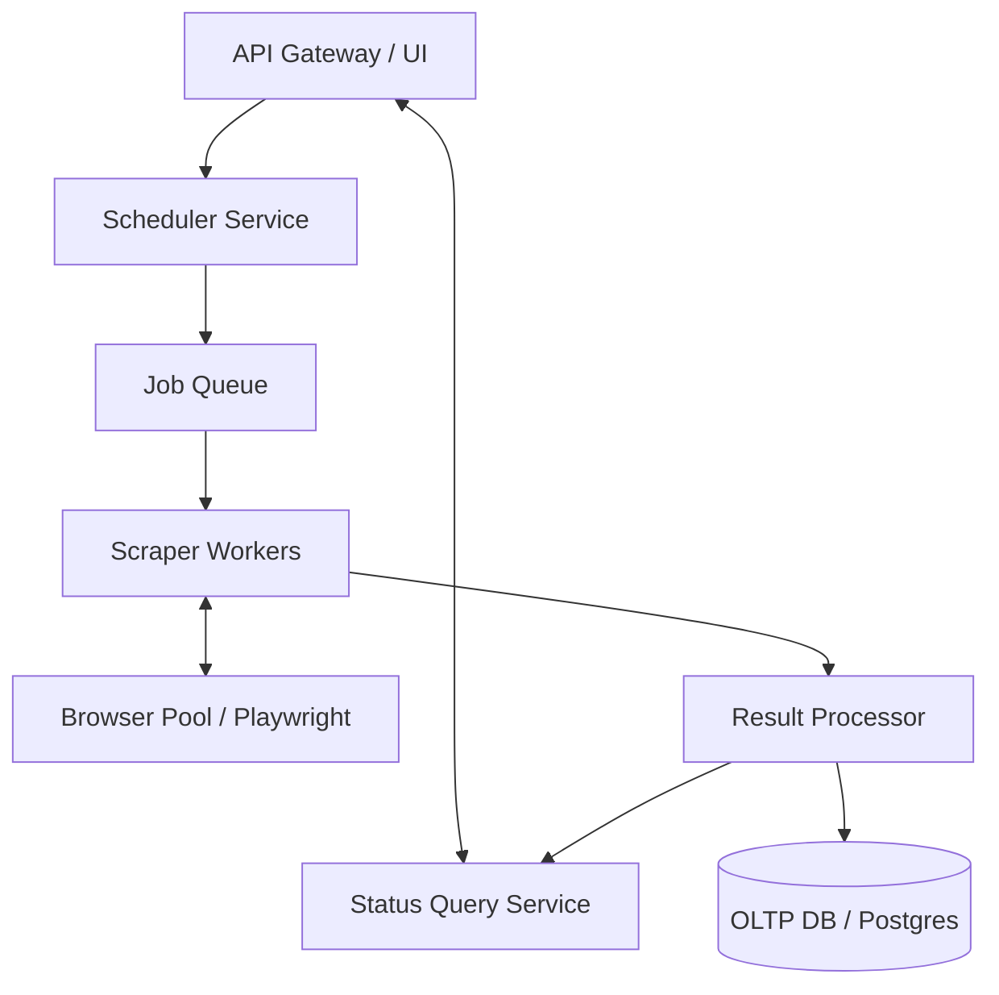

# Scaling the Restaurant Monitor Backend

This document proposes a scalable architecture that can monitor 10,000+ restaurants while addressing the limitations in the current implementation defined in `server.ts`.

## Current Bottlenecks

1. **Sequential scraping** – `/scrape` calls `scrapeSwiggyData` which iterates restaurants one-by-one with two second sleeps and per-request retries, so throughput is limited to a handful of URLs per minute.【F:server.ts†L262-L329】
2. **Ephemeral browsers** – A new headless Chromium instance is launched for each restaurant which creates high CPU and memory load.【F:server.ts†L120-L168】
3. **Per-request Supabase writes** – All results are written synchronously inside the HTTP request lifecycle, preventing the API from returning until every upsert and Slack alert completes.【F:server.ts†L332-L378】
4. **Static configuration** – Target restaurant URLs are hard-coded, preventing dynamic scaling without redeploying code.【F:server.ts†L290-L302】

## High-Level Architecture

### Key Services

- **Scheduler**: Emits jobs for each restaurant at configured intervals. Reads restaurant metadata from the database so the fleet can expand dynamically.
- **Job Queue**: Durable buffer (Amazon SQS, Google Pub/Sub, RabbitMQ) that smooths spikes, enables horizontal scaling, and offers visibility into backlogs.
- **Scraper Workers**: Stateless workers pulling jobs from the queue. Each worker fetches restaurant status and publishes normalized results to the processor. The workers can scale out to dozens of replicas to cover 10,000 restaurants inside SLA windows.
- **Browser Pool**: Manage a shared pool of headless browser contexts (Playwright/Puppeteer cluster) to avoid launching new Chromium processes per job. Pooling reduces startup latency and resource usage.
- **Result Processor**: Consumes worker outputs, deduplicates updates, and persists to Supabase/Postgres. It can also fan out notifications to Slack, PagerDuty, etc.
- **Status Query Service**: Serves API/UI requests using cached data from the database or Redis.

## Detailed Improvements

### 1. Data Model & Configuration
- Store restaurants in a `restaurants` table with metadata: URL, scrape frequency, expected hours (JSONB), geographic tags.
- Use Supabase Edge Functions or a configuration UI so operations can add/remove restaurants without code changes.

### 2. Scalable Scraping Pipeline
- Replace the in-request loop with asynchronous jobs. Fastify route enqueues jobs instead of performing scraping. This makes `/scrape` return immediately and lets background workers do the heavy work.
- Adopt a Puppeteer/Playwright cluster library or run Playwright with persistent Chromium and reuse browser contexts to reduce CPU utilization.
- Use headless browser autoscaling: run workers on Kubernetes, AWS Fargate, or Cloud Run with HPA on queue depth.

### 3. Observability & Resilience
- Emit structured logs and metrics (scrape latency, failures per vendor) to a system like Grafana + Prometheus.
- Instrument retries with exponential backoff (current linear backoff is insufficient at scale) and dead-letter queues for persistent failures.【F:server.ts†L210-L233】
- Implement circuit breakers for vendor rate limits and fallback to cached data when live scraping fails.

### 4. Storage & Caching
- Move from per-request Supabase writes to batched inserts via the result processor. Use Postgres `UPSERT` with indexes on `(restaurant_id, last_checked_at)`.
- Add Redis/Upstash cache for recent results to serve UI queries quickly.

### 5. Notifications
- Instead of firing Slack webhooks inline, publish mismatch events to an SNS topic or queue. A dedicated notification service throttles and deduplicates alerts.

### 6. Security & Compliance
- Store credentials (Supabase keys, Slack webhook) in a secret manager (AWS Secrets Manager, Google Secret Manager).
- Run browsers inside isolated VMs/containers and rotate user agents/IPs via proxies when needed.

### 7. Cost Controls
- Enable autoscaling with minimum worker counts at off-peak hours.
- Prioritize restaurants by business impact; schedule low-priority ones less frequently.

## Roadmap

1. **Phase 1**: Introduce database-backed restaurant catalog and replace synchronous scraping with job queue and worker microservice.
2. **Phase 2**: Add browser pooling, Redis caching, and observability stack.
3. **Phase 3**: Implement advanced notification routing, SLA dashboards, and ML-based anomaly detection.

This architecture enables linear horizontal scaling: simply add more worker replicas to handle additional restaurants, and the queue absorbs bursty demand while keeping the API responsive.
